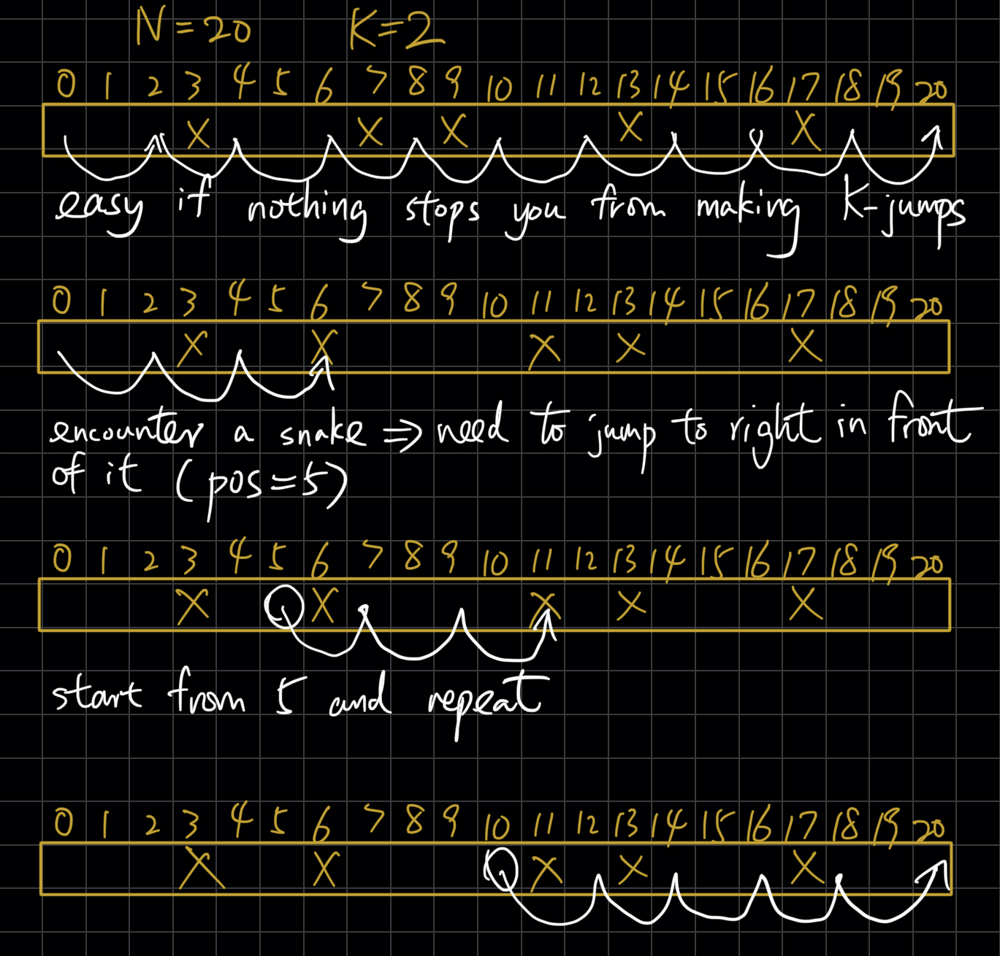
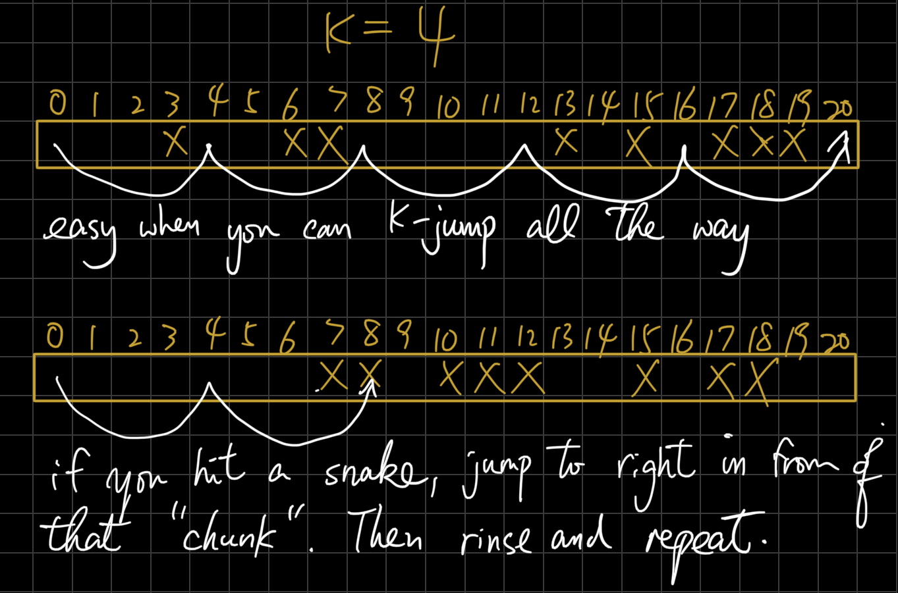

# S194 - Snakes and Snakes (https://judge.hkoi.org/task/S194)
Roadmap:
- Subtask 1 & 2 is trivial
    - Subtask 1: `(N-1) / K + 1`
    - Subtask 2: `N` or `Lonely Christmas` (if there is any snake at all)
- Subtask 4 is the stepping stone to full solution. Try solving for K=2 and you'll get important insights for a more general solution.

## K = 2
- Imagine if all "entry square" of snakes are on odd squares. What is the answer?
- This shows that you don't have any issues as long as you can keep making K-jumps (move K squares forward).


## General solution


## Pseudocode
```
pos = 0
last_x = 0
chunk_size = 0    # this tracks the size of consecutive "snake chunk"
steps = 0   # this is the answer: how many rolls of dice so far
for each "entry square" (x) of snake:
    if x - last_x == 1:
        chunk_size += 1
    else:
        chunk_size = 1
    if chunk_size >= K:
        break
    if (x - pos) % K == 0:  # there is only a problem if a snake is inhibiting a K-jump
        move right up to before the chunk (pos = x - chunk_size)
        update the number of steps to get from prev pos to new pos
    last_x = x

if chunk_size >= K:
    print('Lonely Christmas')
else:
    print number of steps from pos to N
```

## Dynamic Programming for Subtask 3 & 5
### Transition formula
solve(i): minimum steps to get to i
- To get to i, you must pass thru one of the sqaures from i-K to i-1

solve(i) = min( solve(j)+1, for all j from i-K to i-1 )
```
def solve(i):
  if i <= 0:
    return 0
  if i is a snake entry square:
    return INF
  ans = INF
  for j in i-K to i-1:
    ans = min(ans, solve(j) + 1)
  return ans
```
